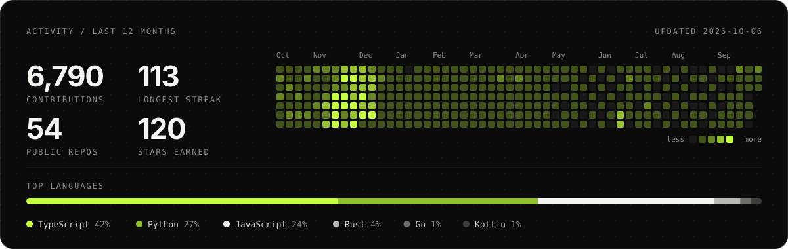

  <a href="https://codecatalysts.tech">codecatalysts.tech</a> &nbsp;·&nbsp;
  <a href="https://www.linkedin.com/in/ayush-sharma-846598300/">LinkedIn</a> &nbsp;·&nbsp;
  <a href="https://x.com/gyanibaba4107">X</a> &nbsp;·&nbsp;
  <a href="https://www.instagram.com/ax_7y18/">Instagram</a> &nbsp;·&nbsp;
  <a href="mailto:iayushsharma.2008@gmail.com">Email</a>

 

I'm a developer in New Delhi. I like building software close to the machine: a terminal, a native macOS utility, an agent whose reasoning you can watch. I build with **[Code Catalysts](https://codecatalysts.tech)** and spend most of my time in TypeScript, Rust, Python and Swift.

### `01` &nbsp;Now

- **[supportpilot](https://github.com/ayushap18/supportpilot)**: an AI support agent with grounded retrieval, typed tools, human review and measurable evals. *Planning.*
- **[tachyon](https://github.com/ayushap18/tachyon)**: a native terminal that writes AI commands you review before they run.
- **[pencyl](https://ayushap18.github.io/pencyl-studio/)**: a notebook-style document studio with a local illustration engine.

### `02` &nbsp;Selected work

  
  
  
  
  
  

### `03` &nbsp;Activity

### `04` &nbsp;Stack

  

