  <a href="https://codecatalysts.tech">codecatalysts.tech</a> &nbsp;·&nbsp;
  <a href="https://www.linkedin.com/in/ayush-sharma-846598300/">LinkedIn</a> &nbsp;·&nbsp;
  <a href="https://x.com/gyanibaba4107">X</a> &nbsp;·&nbsp;
  <a href="https://www.instagram.com/ax_7y18/">Instagram</a> &nbsp;·&nbsp;
  <a href="mailto:iayushsharma.2008@gmail.com">Email</a>

 

I'm a developer in New Delhi. I like building software close to the machine: a terminal, a native macOS utility, an agent whose reasoning you can watch. I build with **[Code Catalysts](https://codecatalysts.tech)** and spend most of my time in TypeScript, Rust, Python and Swift.

### Now

- **[supportpilot](https://github.com/ayushap18/supportpilot)**: an AI support agent with grounded retrieval, typed tools, human review and measurable evals. *Planning.*
- **[tachyon](https://github.com/ayushap18/tachyon)**: a native terminal that writes AI commands you review before they run.
- **[pencyl](https://ayushap18.github.io/pencyl-studio/)**: a notebook-style document studio with a local illustration engine.

### Selected work

<table>
<tr>
<td width="50%" valign="top">

**[Tachyon](https://github.com/ayushap18/tachyon)** 
AI-native terminal. Natural-language commands, an agent that asks before every step, and explanations for failed commands.

`Rust` `Tauri` `Dioxus`

</td>
<td width="50%" valign="top">

**[PokeFolders](https://github.com/ayushap18/pokefolders)** 
Native macOS app for designing elemental folder icons, then applying them straight to Finder.

`Swift` `SwiftUI` `AppKit`

</td>
</tr>
<tr>
<td width="50%" valign="top">

**[ClimaTwin India](https://github.com/ayushap18/climatwin-india)** 
AI digital twin of India's climate, built on IMD and ISRO/INSAT data. Bharatiya Antariksh Hackathon 2026.

`Python` `TypeScript` `ML`

</td>
<td width="50%" valign="top">

**[TraceGraph](https://github.com/ayushap18/tracegraph)** 
Live multi-agent query routing, drawn as a real-time trace graph. See which agent was picked, how confident the router was, and how long each step took.

`Python` `aiohttp` `React` `D3`

</td>
</tr>
<tr>
<td width="50%" valign="top">

**[RagGPT](https://github.com/ayushap18/RagGPT)** 
Self-correcting agentic RAG over your PDFs. Hybrid search, retrievals it grades itself, and checked citations.

`Python` `BM25` `Vectors`

</td>
<td width="50%" valign="top">

**[Pencyl Studio](https://ayushap18.github.io/pencyl-studio/)** 
Notebook-style document design app. Exports HTML, Word and PDF entirely in the browser.

`JavaScript` `Node`

</td>
</tr>
</table>

### Stack

 

Open to freelance web projects. <a href="mailto:iayushsharma.2008@gmail.com">Say hi</a>.
